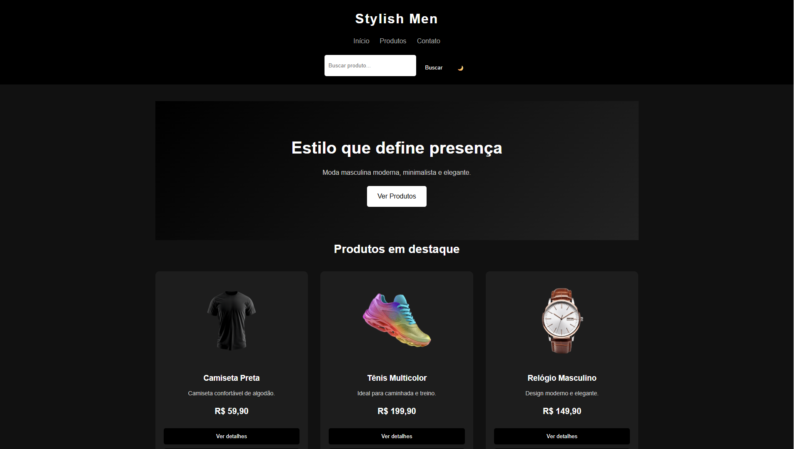

# Stylish Men

Projeto de e-commerce moderno desenvolvido com HTML, CSS e JavaScript puro.

---

# Funcionalidades

- Layout responsivo
- Modo claro e escuro
- Busca de produtos
- Mostrar/esconder detalhes
- Contador de compras
- Data e hora em tempo real
- Toast notifications
- Consumo de API com Fetch API
- Produtos traduzidos dinamicamente
- Renderização dinâmica de produtos
- Aplicação de Clean Code

---

# Tecnologias Utilizadas

- HTML5 Semântico
- CSS3
- JavaScript
- Fetch API
- LocalStorage
- DOM Manipulation
- Responsive Design

---

# API Utilizada

Fake Store API:
https://fakestoreapi.com/

A aplicação consome dados em tempo real da Fake Store API utilizando `fetch()` e renderiza os produtos dinamicamente na interface.

Os produtos e descrições foram traduzidos manualmente para português para melhorar a experiência do usuário.

---

# Preview do Projeto

---

# Objetivo

Aplicar conceitos de desenvolvimento front-end,
responsividade, interatividade com JavaScript,
consumo de API e boas práticas de Clean Code.

---

# Desenvolvedor

Wesley Gomes